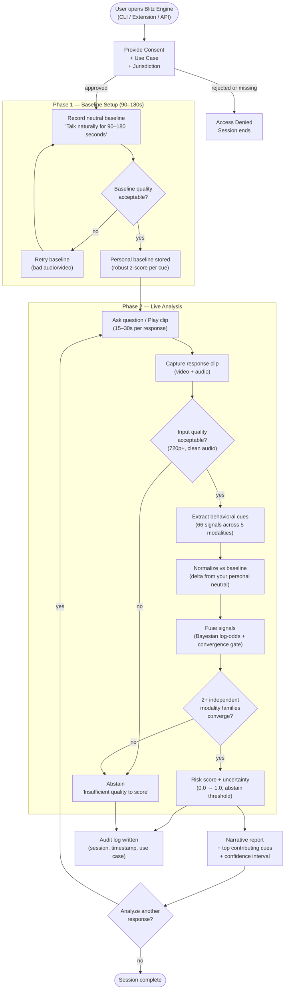
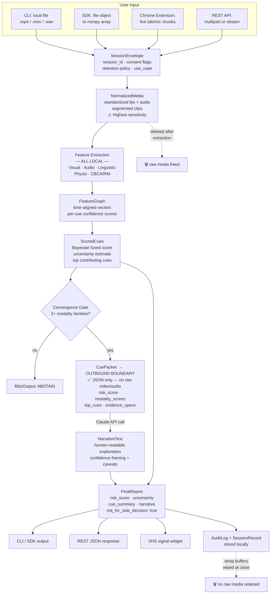
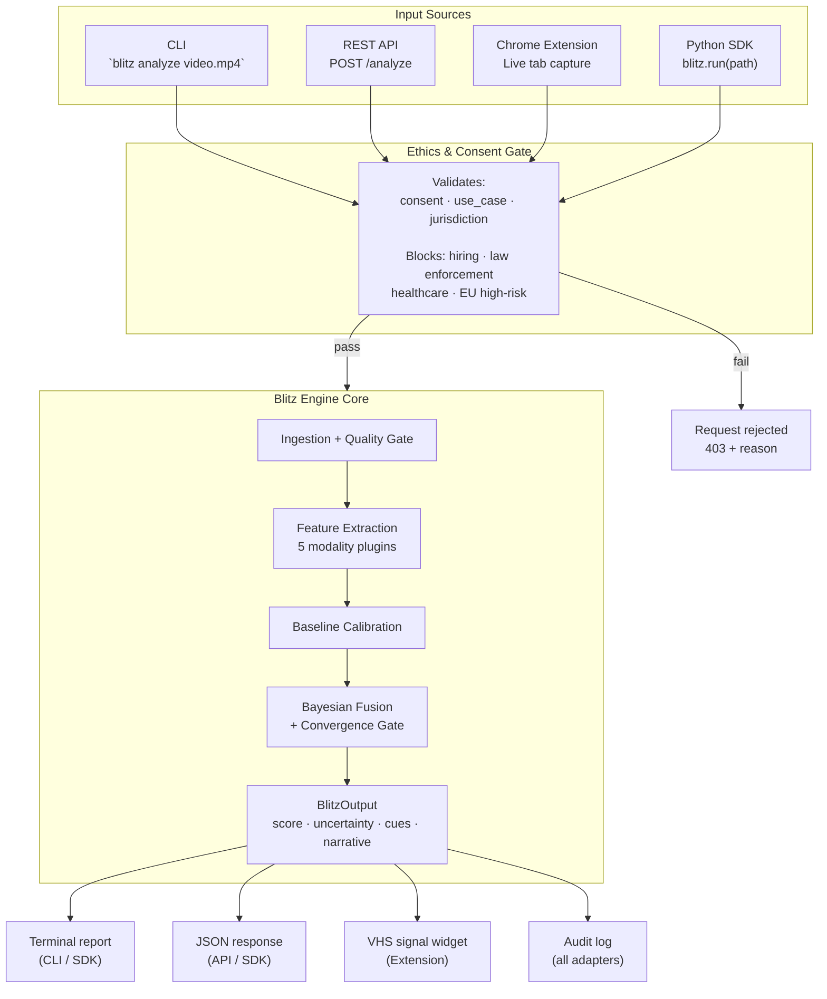

# Blitz Engine

> The open-source behavioral deception detection core.

Blitz Engine is a modular, research-driven engine that analyzes video to detect behavioral deception signals. It combines 66 cues across visual, audio, linguistic, physiological, and cognitive analysis — fused using a Bayesian log-odds architecture with personal baseline calibration.

**Not a lie detector. A behavioral signal analyzer.**

---

## What makes it different

| Feature | Other systems | Blitz Engine |
|---|---|---|
| Baseline | Population thresholds | 90-180s personal calibration |
| Temporal analysis | Averages over clip | 3-phase window per question |
| Fusion | Sum of scores | Bayesian log-odds + convergence gate |
| Correlated cues | Double-counted | Family grouping + effective dimensionality |
| Gender handling | Fixed or stratified weights | Person-relative delta, fairness-audited |
| Output | Single score | Score + uncertainty + cue attribution + compliance |
| Architecture | Monolithic | Modular plugins + canonical CueEvent schema |

---

## 📚 Planning Phase Documentation

All planning artifacts consolidated in [`planning/`](planning/) folder:

| Document | Purpose |
|---|---|
| **[planning/PROJECT_MAP.md](planning/PROJECT_MAP.md)** | Canonical project map — repo reality, source-of-truth rules, implementation order |
| **[planning/INDEX.md](planning/INDEX.md)** | Start here — overview of all planning documents and quick navigation |
| **[planning/BLITZ_ENGINE_SPEC.md](planning/BLITZ_ENGINE_SPEC.md)** | Complete technical specification (30KB) — all 5 layers, 66 cues, APIs, output schema |
| **[planning/LIE_DETECTOR_BLUEPRINT.md](planning/LIE_DETECTOR_BLUEPRINT.md)** | Project blueprint (31KB) — vision, constraints, tech stack, library verification |
| **[planning/ACCURACY_PLAN.md](planning/ACCURACY_PLAN.md)** | Accuracy strategy (14KB) — quality gates, baseline normalization, scoring formula |
| **[planning/RESEARCH.md](planning/RESEARCH.md)** | Implementation research (14KB) — 6 gaps resolved, 2 blockers, library install methods |
| **[planning/signal_preview.py](planning/signal_preview.py)** | VHS signal UI demo — run with `python planning/signal_preview.py` |

`planning/` is the canonical research source tracked in Git. If you keep external mirror copies, sync them from here.

**Total:** ~100 KB planning documentation. Ready for Phase 1 implementation sequencing.

---

## Accuracy (Honest)

| System | Accuracy |
|---|---|
| Human judges (Bond & DePaulo 2006, 24k judges) | 54% |
| SVC 2025 competition winner (cross-domain) | ~62% |
| Blitz Engine Phase 1 target | 70-75% |
| Blitz Engine Phase 2 target (with drift correction) | 75-80% |

The 85-99% numbers in papers are lab overfitting on tiny datasets (121-320 clips). We don't claim those numbers.

---

## How It Works

### User Session Flow

From consent gate through baseline calibration, live analysis, and final report — or an explicit abstain when quality is insufficient.



---

### Data States & Privacy

What form your data takes at every step — and what leaves your device.



---

### Application Adapters

How CLI, REST API, Chrome Extension, and Python SDK all route through the ethics gate into one core engine.



---

## Architecture

```
┌─────────────────────────────────────────────────────────────┐
│  LAYER 1: INGESTION — video + audio normalization            │
├─────────────────────────────────────────────────────────────┤
│  LAYER 2: FEATURE EXTRACTION — 5 modality plugins           │
│  Visual | Audio | Linguistic | Physiological | CBCA/RM       │
├─────────────────────────────────────────────────────────────┤
│  LAYER 3: PERSONAL CALIBRATION — 90-180s baseline           │
│  Trait + state stress + deception residual                   │
├─────────────────────────────────────────────────────────────┤
│  LAYER 4: BAYESIAN FUSION — hybrid architecture             │
│  Cue experts → cross-modal attention → log-odds → gate      │
├─────────────────────────────────────────────────────────────┤
│  LAYER 5: OUTPUT — risk score + uncertainty + attribution    │
└─────────────────────────────────────────────────────────────┘
```

Full specification: [planning/BLITZ_ENGINE_SPEC.md](planning/BLITZ_ENGINE_SPEC.md)

---

## The 66 Cues

| Domain | Count | Key signals |
|---|---|---|
| Visual / facial | 20 | Micro-expressions, gaze fixation, blink rebound, pupil dilation |
| Audio / vocal | 13 | VOT shortening (AUC 0.89), voice tremor, formant dispersion |
| Linguistic / NLP | 18 | Spontaneous corrections, MTLD diversity, NLI contradiction |
| Physiological rPPG | 5 | Multi-ROI divergence, contactless EDA proxy |
| CBCA / RM | 10 | Peripheral details (g=0.64), cognitive operations density |

Full catalog: [docs/CUE_CATALOG.md](docs/CUE_CATALOG.md)

---

## Quick Start (planned — Phase 1)

```python
from blitz_engine import BlitzEngine

engine = BlitzEngine(modalities=["visual", "audio", "linguistic"])

session = engine.new_session(
    baseline_video="baseline_90s.mp4",
    consent=True,
    use_case="research",
    jurisdiction="CA-US"
)

result = session.analyze(
    video_clip="response.mp4",
    question="Where were you on Tuesday?"
)

print(result.risk_score)     # 0.72
print(result.uncertainty)    # 0.15
print(result.narrative)      # "At 14.2s, VOT shortening + jaw tension..."
```

---

## Repo Structure

```
blitz-engine/
├── core/              Engine: schemas, calibration, fusion, scoring, quality
├── modalities/        Plugins: visual, audio, linguistic, physiological, cbca_rm
├── apps/              Adapters: chrome-extension, web-api, cli
├── evaluation/        Benchmarks, fairness audits, baselines
├── governance/        Ethics, intended use, prohibited uses, model card
├── docs/              Architecture spec, cue catalog, guides
└── planning/          Canonical research bundle and implementation map
```

---

## Ethics & Legal

This software is for **research, education, and journalism only**.

- Accuracy is 70-75% — false positive rate is ~25-30%
- Every API call requires declared consent, use case, and jurisdiction
- `not_for_sole_decision` flag is always true and cannot be disabled
- **Prohibited:** hiring, law enforcement, insurance, healthcare, education discipline

See [governance/PROHIBITED_USES.md](governance/PROHIBITED_USES.md) and [governance/ETHICS.md](governance/ETHICS.md).

EU AI Act (Regulation 2024/1689) applies. Do not deploy for high-risk uses in EU without legal review.

---

## Status

- [x] Phase 0 — Research complete, planning consolidated, repo initialized
- [ ] Phase 1 — Core engine (all 5 layers + modality plugins + CLI)
- [ ] Phase 2 — Applications (FastAPI, Python SDK, Chrome Extension)
- [ ] Phase 3 — Validation (benchmark + fairness audit + model card)
- [ ] Phase 4 — Hardware extension (thermal camera)

---

## License

Apache 2.0 — free for academic, research, and personal use. Attribution required.
See [governance/PROHIBITED_USES.md](governance/PROHIBITED_USES.md) for use restrictions.

---

## Research Foundation

- DePaulo et al., 2003 — Cues to deception (PMID: 12555795)
- Bond & DePaulo, 2006 — Accuracy of deception judgments (PMID: 16859438)
- Bogaard et al., 2024 — Baselining efficacy (doi:10.1016/j.actpsy.2023.104112)
- Guo et al., 2023 — DOLOS + PECL (arXiv:2303.12745)
- Lin et al., 2025 — SVC 2025 challenge results (arXiv:2508.04129)
- EU AI Act, 2024 — Regulation 2024/1689
